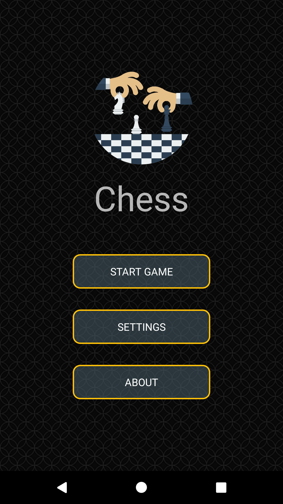
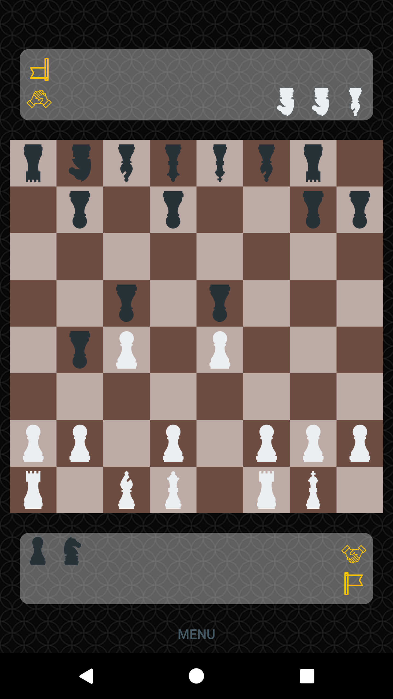
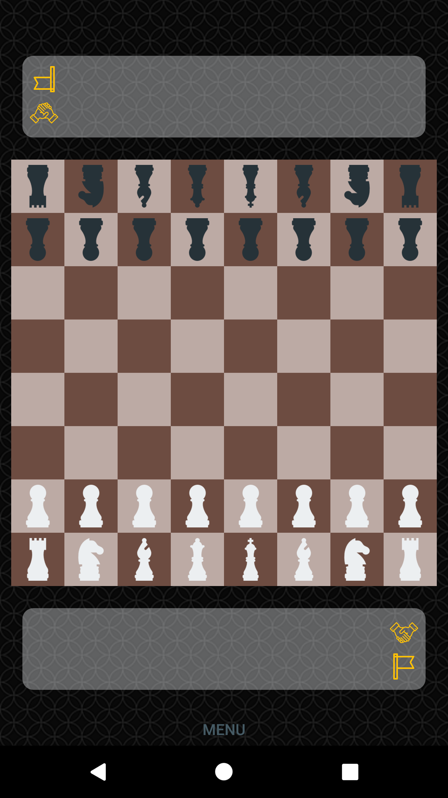
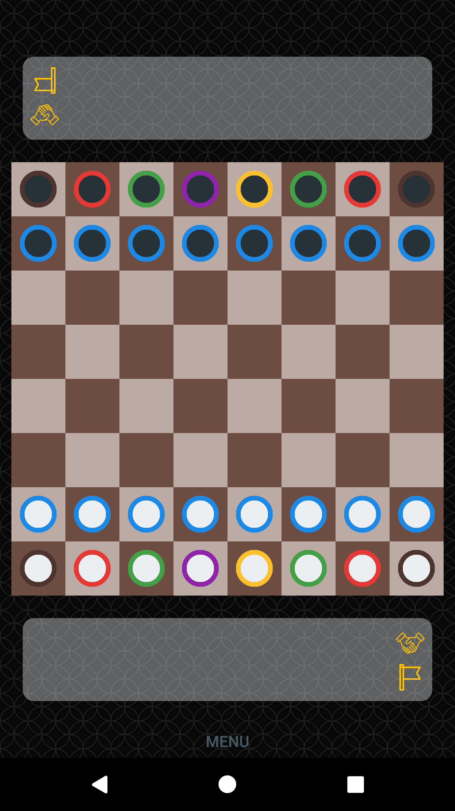
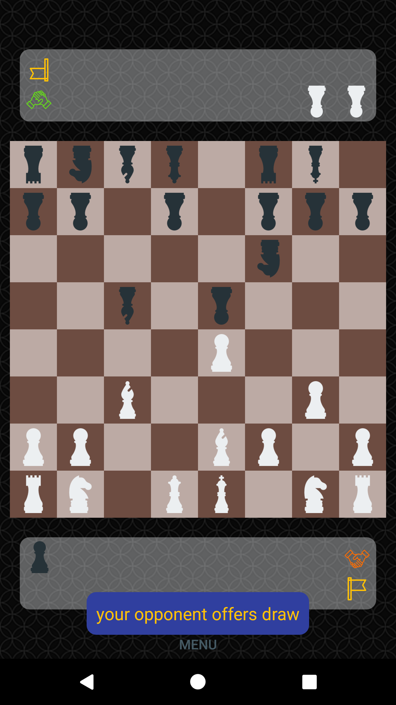
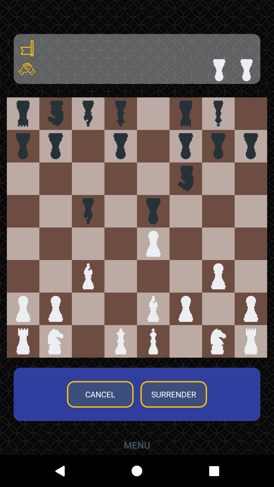
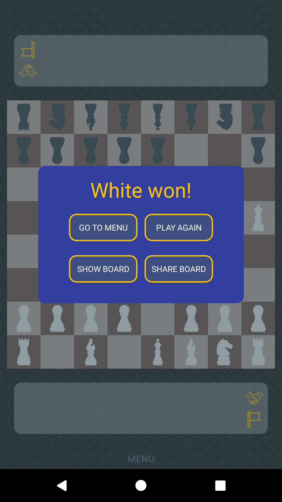

# Chess Time Android
A small chess app for face to face games on Android phones. It is my first independent Android project. My aim was to practice Java and Android SDK. I also deployed this app to Play Store, to discover this process. 

 

## about
Chess Time let users take a face to face chess game. App supports all chess rules, including *promotion* and *en passant*.

Players can choose between two pieces style *classic* and *modern*.
<br> 

Game can end at any time with a draw or surrending by one player. Each player has two buttons, one dedicated to offer a draw, second to surrender. When draw button is clicked by one player, second gets notified about it and if he presses his button, game ends with a draw. Of course draw offer can be withdrawn any time before being confirmed. After clicking surrender button player is asked to confirm surrending. If he does so, game ends with victory of second player. <br> 

After the game ends players can review the board or share it(*available soon*).
<br>

## implementation
tba

## code tricks
When implementing event listeners on objecs during runtime, instead of classic way I used lambda expressions:

**classic implementation:**
```java
someButton.setOnClickListener(new View.OnClickListener() {
            @Override
            public void onClick(View view) {
                // your code
            });
```

**lambda implementation:**
```java
someButton.setOnClickListener(view -> {
                // your code
            });
```

## get it
As soon as public relase will be available on Play Store, I will post link to it here.
